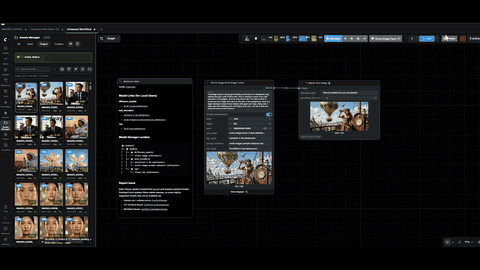

# Majoor Assets Manager for ComfyUI

[](https://github.com/MajoorWaldi/ComfyUI-Majoor-AssetsManager)
[](https://github.com/MajoorWaldi/ComfyUI-Majoor-AssetsManager/stargazers)
[](https://github.com/MajoorWaldi/ComfyUI-Majoor-AssetsManager/network/members)
[](https://github.com/MajoorWaldi/ComfyUI-Majoor-AssetsManager/issues)
[](LICENSE)
[](https://github.com/MajoorWaldi/ComfyUI-Majoor-AssetsManager/actions/workflows/python-tests.yml)
[](https://ko-fi.com/majoorwaldi)

Majoor Assets Manager is an advanced asset browser for ComfyUI that provides a comprehensive solution for managing, organizing, and viewing your generated assets. It integrates directly into ComfyUI, offering features like full-text search, metadata extraction, rating and tagging systems, and advanced viewing capabilities.



## Quick Start

- **User Guide:** [user_guide.html](user_guide.html)
- **Installation:** [Installation](#installation)
- **Changelog:** [CHANGELOG.md](CHANGELOG.md)
- **Documentation Index:** [docs/DOCUMENTATION_INDEX.md](docs/DOCUMENTATION_INDEX.md)

## GitHub

- **Repository:** https://github.com/MajoorWaldi/ComfyUI-Majoor-AssetsManager
- **Author:** MajoorWaldi

## License

Copyright (c) 2026 Ewald ALOEBOETOE (MajoorWaldi).

Licensed under the **GNU General Public License v3.0**. See `LICENSE`.

Optional attribution request (non-binding): see `NOTICE`.

## Key Features

### Performance & Navigation
- **Virtual Scrolling Engine**: Seamlessly handles grid views with 10,000+ assets with zero UI lag.
- **Non-Blocking Indexing**: Background scanning and metadata parsing (using worker threads) ensures the ComfyUI server remains responsive.
- **Database Optimization**: SQLite WAL mode + Connection Pooling for high-concurrency access.

### Advanced Visualization
- **GPU-Accelerated Video**: WebGL-based video player for real-time grading (Exposure/Gamma/Zebra) of 4K content.
- Viewer modes: single, A/B compare, side-by-side.
- Navigation: zoom/pan, 1:1 pixel zoom, quick next/prev navigation.
- Tools: exposure (EV), gamma, channel view (RGB/R/G/B/Alpha/Luma), analysis (false color, zebra).
- **Video Grading**: Real-time color adjustments using WebGL (Hardware Accelerated).
- Scopes (optional): downscaled RGB histogram + luma waveform.
- Overlays: grid (thirds/center/safe/golden), pixel probe, loupe.
- Compare: wipe (slider) and difference mode.
- Export: save current frame to PNG + copy to clipboard (best-effort).

### Metadata & Workflows
- Extracts generation info from PNG/WEBP/video (ExifTool/FFprobe; degrades gracefully).
- Recognizes modern workflows such as Qwen (Edit), Flux (Advanced/GGUF), WanVideo (Kijai), HunyuanVideo (Kijai), and Marigold (Depth).
- Generation Info panel: prompt/model/sampling/image parameters + workflow minimap, with loading/error feedback and retry for transient failures.
- Video: loops by default; player bar provides seek, In/Out range, loop/once, frame stepping, and FPS/step controls.

### Search & Filtering
- Full-text search powered by SQLite **FTS5** (BM25 ranking).
- Scope: **Outputs**, **Inputs**, **Custom roots**, **Collections**.
- Filters: kind, min rating, workflow-only, date filters, sorting.
- Optional: hide PNG siblings of video previews.
- Summary line: total assets + selected count + current context.

### Asset Management
- Ratings/tags stored in the index DB and (optionally) synced into files when enabled.
- Collections: create, add items (duplicates skipped and reported), remove items, open as a view. Large collections are capped for safety (configurable).
- Context menu: tags, rating, add to collection, open in folder, rename, delete.

### Drag & Drop
- Drag an asset onto the ComfyUI canvas: stage to input, inject paths into compatible nodes.
- Drag out to the OS (Explorer/Desktop): uses `DownloadURL`/`text/uri-list` and supports multi-selection ZIP (flat ZIP; folders excluded).

### UX Details
- Filename collision indicator: if multiple assets share the same filename, the extension badge shows `EXT+` (e.g. `PNG+`).
- Context menus: add/remove collection, open viewer, open in folder, copy path, etc.

## Installation

### Method A (Recommended): ComfyUI Manager
Install via the ComfyUI Manager UI.

### Installing a specific version or nightly build
You can install a specific release tag or the nightly branch by using the GitHub ZIP archive URL. Example patterns:

- Release tag (example):

  https://github.com/MajoorWaldi/ComfyUI-Majoor-AssetsManager/archive/refs/tags/v2.3.3.zip

- Nightly / latest main branch (example):

  https://github.com/MajoorWaldi/ComfyUI-Majoor-AssetsManager/archive/refs/heads/main.zip

If your ComfyUI registry or manager accepts a zip URL, paste one of the above URLs to install that specific ref. The extension manifest includes a `releases.zip_url_template` that tools can use to programmatically construct these URLs; the template is:

`https://github.com/MajoorWaldi/ComfyUI-Majoor-AssetsManager/archive/refs/{ref}.zip`

Use `{ref}` = `tags/vX.Y.Z` for a tag, or `{ref}` = `heads/<branch>` (for example `heads/main`) for branch installs (nightly).

### Method B: Manual Install
```bash
cd ComfyUI/custom_nodes
git clone https://github.com/MajoorWaldi/ComfyUI-Majoor-AssetsManager ComfyUI-Majoor-AssetsManager
pip install -r ComfyUI-Majoor-AssetsManager/requirements.txt
```
Restart ComfyUI.

If dependencies are missing at startup, install them explicitly:

```bash
python ComfyUI-Majoor-AssetsManager/scripts/install-requirements.py
```

No dependency installation is executed automatically at import time.

### Required Python Packages

Runtime requirements are defined in `requirements.txt`:

- `aiohttp>=3.8.0`
- `aiosqlite>=0.20.0`
- `pillow>=11.0.0`
- `send2trash>=1.8.0`
- `watchdog>=3.0.0`
- `pywin32>=300` (Windows only)

Install manually with one of:

```bash
pip install -r ComfyUI-Majoor-AssetsManager/requirements.txt
```

or

```bash
python ComfyUI-Majoor-AssetsManager/scripts/install-requirements.py
```

### Tkinter Note (Embedded Python)
The native folder picker (`/mjr/sys/browse-folder`) requires built-in `tkinter`.  
On embedded Python builds (for example `python_embeded` / `python_embedded`), `tkinter` is often missing.  
In that case (or on headless Linux without `DISPLAY`), the backend returns a picker-unavailable error and the UI should use manual path entry.

- The extension remains fully functional with manual path input.
- `pip install tk` is not a replacement for built-in `tkinter`.
- If you need the native folder picker, use a full Python installation with `tkinter`.

### Optional (Recommended): ExifTool + FFprobe

The Assets Manager works without these tools, but **metadata extraction** (generation info, media probe) and **tag/rating sync to files** are best-effort and will be **degraded** if the tools are missing.

Verify they are available in your `PATH`:
```bash
exiftool -ver
ffprobe -version
```

If they are not in `PATH`, set `MAJOOR_EXIFTOOL_PATH` and/or `MAJOOR_FFPROBE_PATH` (see Environment Variables below).

#### Windows
Option A (Scoop):
```powershell
scoop install ffmpeg exiftool
```

Option B (Chocolatey):
```powershell
choco install -y ffmpeg exiftool
```

Option C (WinGet):
```powershell
winget install -e --id Gyan.FFmpeg
winget install -e --id PhilHarvey.ExifTool
```
If the IDs differ on your machine, use `winget search ffmpeg` / `winget search exiftool`.

Option D (manual download):
- FFprobe is included with FFmpeg builds: install FFmpeg and ensure the `bin/` folder is in your `PATH`.
- ExifTool: download from `https://exiftool.org/` and point `MAJOOR_EXIFTOOL_PATH` to `exiftool.exe` if needed.

#### macOS
```bash
brew install ffmpeg exiftool
```

#### Linux
Debian/Ubuntu:
```bash
sudo apt-get update
sudo apt-get install -y ffmpeg exiftool
```

Package names can vary by distro (e.g. `perl-Image-ExifTool` on some).

## Usage

- Open the **Assets Manager** panel/tab.
- Pick a scope (**Outputs / Inputs / Custom / Collections**).
- Use search + filters; right-click cards for actions; double-click to open the viewer.
- Use **Collections** to save sets of files and browse them later.
- Drag assets:
  - to the ComfyUI canvas (staging/inject path),
  - or to your OS (single file or a ZIP for multi-selection).

## Route Registration (Custom Nodes)

To avoid duplicate middleware/route injection, use explicit initialization with an aiohttp app:

```python
from ComfyUI_Majoor_AssetsManager import init

def setup_with_app(app):
    init(app)
```

Auth-aware variant (recommended):

```python
from ComfyUI_Majoor_AssetsManager import register

def setup_with_app(app, user_manager):
    register(app, user_manager=user_manager)
```

Notes:
- `register_routes(app)` is idempotent per app instance.
- No `sys.modules` replacement is required.
- Do not call both manual registration and another auto-registration path for the same app.

### API Namespace & Versioning

- Extension endpoints are namespaced under `/mjr/am/...` to avoid collisions with ComfyUI native APIs (for example `/api/assets/...`).
- Versioned compatibility path is supported via middleware redirect: `/mjr/am/v1/...` -> `/mjr/am/...` (HTTP 308).
- During startup, the extension performs a route-collision check against existing app routes and logs overlaps if detected.

## Hotkeys (high level)

Hotkeys are ignored while typing inside inputs.

- `Ctrl/Cmd+S`: trigger an index scan for the current scope.
- `D`: toggle details sidebar for the current selection.
- `0`-`5`: set rating for the current selection (when interacting with the grid).
- Viewer:
  - Viewer hotkeys are consumed (do not leak to ComfyUI/global handlers).
  - `Esc`: close viewer
  - `0`-`5`: set rating (single view)
  - `Shift+Arrow`: step video frames (single video)
  - `F`: false color toggle
  - `Z`: zebra toggle
  - `G`: grid cycle (off -> thirds -> center -> safe -> golden)
  - `I`: pixel probe toggle
  - `L`: loupe toggle
  - `C`: copy last probed color hex
  - `Alt+1`: toggle 1:1 zoom

## Settings

Settings are stored under the `mjrSettings` key in `localStorage` (browser-side).

Backend persistence includes `probeBackend.mode`, metadata fallback toggles, output-directory override, and security preferences (stored in SQLite `metadata`). UI layout/visual preferences remain browser-local (`localStorage`) and are not synced across machines/browsers.

Remote access & API Token:
- The UI exposes an **API token** field for client-side header injection. The authoritative backend token still comes from environment variables (`MAJOOR_API_TOKEN` / `MJR_API_TOKEN`) at startup.
- Remote write behavior is controlled by backend security settings/env vars (`MAJOOR_REQUIRE_AUTH`, `MAJOOR_ALLOW_REMOTE_WRITE`, and security prefs).

- Page size (assets per request)

## Compatibility & CI

This project supports Python 3.10 through 3.12, with upstream ComfyUI guidance recommending Python 3.13 (3.12 as the stable fallback). GitHub Actions now runs both `ci-python.yml` and `python-tests.yml` on `ubuntu-22.04` with `actions/setup-python@v4` targeting Python 3.12 so the runner closely matches the ComfyUI best-practice environment.

ComfyUI compatibility baseline:
- Minimum recommended ComfyUI: `0.13.0`
- Tested frontend baseline: `1.38.x`
- Older/development snapshots may break extension APIs; upgrade both ComfyUI backend and frontend together.

API reference:
- Full endpoint table: `docs/API_REFERENCE.md`

Run tests across multiple Python versions locally with `tox` (requires those Python versions installed):

```bash
pip install tox
tox
```

Frontend compatibility notes:
- UI classes/components are namespaced with `mjr-am-*` to reduce CSS/JS collisions.
- ComfyUI frontend API access is centralized in `js/app/comfyApiBridge.js` (API, settings, sidebar registration) for legacy/new frontend compatibility.
- i18n detection supports legacy and newer ComfyUI frontend locale surfaces, with fallback:
  1. Stored Majoor language
  2. ComfyUI locale settings/runtime
  3. Browser/document locale
  4. `en-US`
- Majoor API endpoints are namespaced under `/mjr/am/*`.
- Frontend bundle hygiene checks:
  - `npm run check:frontend-size`
  - `npm run check:frontend-imports`
- Auto-scan (on open / on startup)
- Status poll interval
- Sidebar position (left/right)
- Hide PNG siblings (video previews)
- Sync rating/tags to files (best-effort; requires tools)
- Media probe backend (auto/exiftool/ffprobe/both)
- Observability (request logging)
- Tags cache TTL (ms)
- Workflow minimap display toggles

## Environment Variables (backend)

Canonical namespace is now `MJR_AM_...` to avoid collisions with ComfyUI/global environment variables.

Compatibility aliases are still accepted (`MAJOOR_...` and some `MJR_...` names), but new deployments should prefer `MJR_AM_...`.

- `MJR_AM_OUTPUT_DIRECTORY` (alias: `MAJOOR_OUTPUT_DIRECTORY`) - override output directory
- `MJR_AM_EXIFTOOL_PATH` / `MJR_AM_FFPROBE_PATH` (aliases: `MAJOOR_*`) - tool executable paths
- `MJR_AM_MEDIA_PROBE_BACKEND` (alias: `MAJOOR_MEDIA_PROBE_BACKEND`) - `auto|exiftool|ffprobe|both`
- `MJR_AM_EXIFTOOL_MIN_VERSION` / `MJR_AM_FFPROBE_MIN_VERSION` (aliases: `MAJOOR_*`)
- `MJR_AM_ENABLE_WATCHER` (alias: `MJR_ENABLE_WATCHER`) - enable file watcher
- `MJR_AM_WATCHER_DEBOUNCE_MS` / `MJR_AM_WATCHER_DEDUPE_TTL_MS` (aliases: `MJR_WATCHER_*`)
- `MJR_AM_WATCHER_PENDING_MAX` / `MJR_AM_WATCHER_MAX_FLUSH_CONCURRENCY` (aliases: `MJR_WATCHER_*`)
- `MJR_AM_WATCHER_MIN_FILE_SIZE_BYTES` / `MJR_AM_WATCHER_MAX_FILE_SIZE_BYTES` (aliases include legacy `MAJOOR_WATCHER_*`)
- `MAJOOR_SCAN_IOPS_LIMIT` - optional scan I/O pacing (ops/sec) for directory walk on slow NAS/SMB (`0` disables)
- `MJR_DB_CONSISTENCY_SAMPLE` / `MJR_DB_CONSISTENCY_COOLDOWN_SECONDS` - periodic consistency sweep tuning
- `MJR_AM_DB_TIMEOUT` / `MJR_AM_DB_MAX_CONNECTIONS` / `MJR_AM_DB_QUERY_TIMEOUT` (aliases: `MAJOOR_*`)
- `MJR_AM_TO_THREAD_TIMEOUT` (alias: `MAJOOR_TO_THREAD_TIMEOUT`) - timeout for `asyncio.to_thread(...)` work in HTTP handlers
- `MJR_AM_MAX_METADATA_JSON_BYTES` (alias: `MAJOOR_MAX_METADATA_JSON_BYTES`)
- `MJR_AM_CLEANUP_RESERVED_NAMES` - set to `1` to enable Windows reserved-name cleanup in `custom_nodes` (disabled by default)
- `MJR_COLLECTION_MAX_ITEMS` - max items per collection JSON (default `50000`)
- `MJR_ALLOW_SYMLINKS` - allow symlink/junction custom roots (default `off`)
- `MAJOOR_TRUSTED_PROXIES` - comma-separated IPs/CIDRs allowed to supply `X-Forwarded-For`/`X-Real-IP` (default `127.0.0.1,::1`)
- `MAJOOR_API_TOKEN` (or `MJR_API_TOKEN`) - optional token to authorize write operations (send via `X-MJR-Token` or `Authorization: Bearer <token>`)
- `MAJOOR_REQUIRE_AUTH` - require token auth even for localhost
- `MAJOOR_ALLOW_REMOTE_WRITE` - allow non-local write operations without token (**unsafe**)
- `MAJOOR_SAFE_MODE` - safe-mode gate for write operations
- `MAJOOR_ALLOW_WRITE` / `MAJOOR_ALLOW_DELETE` / `MAJOOR_ALLOW_RENAME` / `MAJOOR_ALLOW_OPEN_IN_FOLDER` / `MAJOOR_ALLOW_RESET_INDEX` - operation gates (also configurable via persisted security preferences)

### API Token Setup

The API token is user-defined. Set `MAJOOR_API_TOKEN` (or `MJR_API_TOKEN`) before starting ComfyUI.

**Windows (PowerShell):**

```powershell
$env:MAJOOR_API_TOKEN = "my-secret-token"
```

**Windows (CMD):**

```cmd
set MAJOOR_API_TOKEN=my-secret-token
```

**Linux / macOS:**

```bash
export MAJOOR_API_TOKEN="my-secret-token"
```

Once set, include the token in your API requests via one of these headers:
- `X-MJR-Token: my-secret-token`
- `Authorization: Bearer my-secret-token`

| Scenario | Behavior |
| --- | --- |
| No token set (default) | Write operations allowed only from localhost (`127.0.0.1` / `::1`) |
| Token set | All write operations require the token |
| `MAJOOR_REQUIRE_AUTH=1` | Forces token auth even for localhost |

### Security Summary

- Without token: write operations are localhost-only (unless `MAJOOR_ALLOW_REMOTE_WRITE=1`).
- With token: write operations require authentication.
- Operation gates for delete/rename/open-in-folder/reset-index are enforced via security prefs and corresponding `MAJOOR_ALLOW_*` env vars.
- Safe Mode behavior is controlled by `MAJOOR_SAFE_MODE` and persisted security preferences.
You can persist the same secret in ComfyUI's Settings modal under **Security -> Majoor: API Token**. The Assets Manager stores it in browser storage and automatically sends both `X-MJR-Token` and `Authorization: Bearer ...` on behalf of the UI, so remote clients only need to match the shared secret between the backend environment and the settings field.
The backend still requires the environment variable (`MAJOOR_API_TOKEN`/`MJR_API_TOKEN`) when ComfyUI starts; the UI control just remembers it for you so the headers stay in sync.

## Security Model (high level)

- **CSRF**: state-changing endpoints require `X-Requested-With: XMLHttpRequest` (or `X-CSRF-Token`) and validate `Origin` vs `Host` when present.
- **Rate limiting**: in-memory per-client limits exist on expensive endpoints (search/scan/metadata/batch-zip). Client identity is based on IP; `X-Forwarded-For` is only honored when the connection comes from `MAJOOR_TRUSTED_PROXIES`.
- **Path safety**: file operations validate root containment for output/input/custom roots and reject paths outside allowed roots (symlink/junction handling is opt-in).
- **Write access**: loopback-only by default when no token is configured (can be relaxed by `MAJOOR_ALLOW_REMOTE_WRITE=1`).
- **Operation gating**: delete/rename/open-in-folder/reset-index and write behavior are enforced by security prefs + `MAJOOR_ALLOW_*` / `MAJOOR_SAFE_MODE`.
- **Batch ZIP**: ZIP building streams from an open file handle (avoids TOCTOU rename/replace races).

## UI Preview


## Files & Storage

- Index DB: `<output>/_mjr_index/assets.sqlite`
- Custom roots store: `<output>/_mjr_index/custom_roots.json`
- Collections store: `<output>/_mjr_index/collections/*.json`
- Temporary drag-out ZIPs: `<output>/_mjr_batch_zips/` (auto-cleaned)

## Troubleshooting (DB Corruption)

If the index DB is too corrupted, use the emergency endpoint:

- `POST /mjr/am/db/force-delete`

This force-deletes the SQLite files, recreates a clean DB, then triggers a rescan.

Manual fallback (with ComfyUI stopped):

- Delete:
  - `assets.sqlite`
  - `assets.sqlite-wal`
  - `assets.sqlite-shm`
- Location: `<output>/_mjr_index/`
- Restart ComfyUI, then run a scan/reset index.

## Development

```bash
python -m pytest -q
```

Type/lint checks:

```bash
python -m mypy --config-file mypy.ini
python -m ruff check mjr_am_backend mjr_am_shared tests
python -m black --check mjr_am_backend mjr_am_shared tests
```

### Tests (Windows)

Batch runners generate both JUnit XML and a styled HTML report in `tests/__reports__/`:

- Full suite: `run_tests.bat` (or `tests/run_tests_all.bat`)
- Quick suite (skips the long Comfy output scan): `run_tests_quick.bat`
- Metadata / parser suite: `run_tests_parser.bat` (runs `tests/metadata/`)

Open the report index:
- `tests/__reports__/index.html`

Test runtime DB artifacts (`*.db`, `*.db-wal`, `*.db-shm`, etc.) are created under:
- `tests/__pytest_tmp__/`

Parser samples scan (metadata suite):
- Put sample files under `tests/parser/` (subfolders supported), or set `MJR_TEST_PARSER_DIR` to an external folder.

## Release (zip)

On Windows, build a clean drop-in zip (excludes `.git/`, caches, etc.):

```powershell
pwsh -File scripts/make_release_zip.ps1
```

## Architecture

- `mjr_am_backend/` - Python backend (routes + features)
  - `features/index` (scan/search), `features/metadata` (extract), `features/tags` (sync), `features/collections`
  - `routes/handlers` (HTTP), `routes/core` (security/paths/response)
- `js/` - frontend extension
  - `features/grid`, `features/panel`, `features/viewer`, `features/dnd`
  - `components` (Card/Viewer/Sidebar/menus), `app` (settings/bootstrap), `theme`

## Upgrade Guide (Major ComfyUI Changes)

When ComfyUI introduces major frontend/backend API changes:
1. Update to a pinned ComfyUI stable tag first.
2. Verify route registration and `/mjr/am/health` in the browser.
3. Run compatibility tests (`tests/compat/*`) and full pytest.
4. Check frontend bridge (`js/app/comfyApiBridge.js`) for API surface changes.
5. Re-validate i18n + settings registration in UI.

## Viewer Roadmap (bigger items)

- GPU grade (WebGL2): exposure/gamma/channels/zebra/false color.
- OffscreenCanvas + Worker fallback for heavy processing.
- Cache processed frame while paused (instant grade tweaks).


