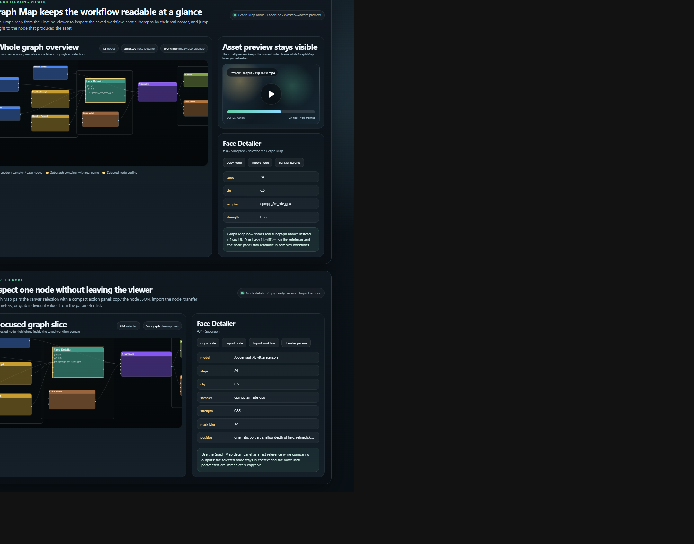

# Graph Map Guide

**Last Updated**: May 10, 2026

## Overview

Graph Map is the workflow-aware navigation view inside the Majoor Floating Viewer.

It is designed for one fast job: keep the saved workflow readable while you inspect the asset that came out of it.

Graph Map combines three things in one place:

- a large workflow map with readable node labels
- a selected-node detail panel with copy/import actions
- a small asset preview that keeps the current media visible while the panel refreshes

## Why It Exists

When a workflow gets large, the usual minimap is useful for shape but not for understanding.

Graph Map adds the missing context:

- real node labels instead of anonymous boxes
- subgraph names that stay human-readable instead of raw UUID or hash identifiers
- a direct bridge between the saved workflow and the asset currently shown in the viewer

This is especially useful for video workflows, larger prompt-routing graphs, and pipelines that rely on nested subgraphs.

## How To Open It

1. Open an asset in the Majoor Floating Viewer.
2. Switch the viewer to **Graph Map** mode.
3. If you also open the **Node Parameters** sidebar, use the **Graph Map** tab to keep the small preview and node details visible together.

Graph Map only appears when the selected asset contains readable workflow data.

## What You See

### 1. Workflow overview

The large map shows the saved workflow structure with node labels, links, and the current selection highlight.

- loader, sampler, and output nodes remain easy to spot
- subgraphs are labeled with their real names when that metadata is available
- the selected node is outlined so you can keep your position while panning or zooming

### 2. Selected node detail panel

When you click a node in Graph Map, the detail panel shows the node title, its type, and the most useful simple parameters.

Available actions include:

- **Copy node**
- **Import node**
- **Import workflow**
- **Transfer params to selected canvas node**

You can also click individual parameter rows to copy a single value.

### 3. Asset preview

The small preview keeps the active asset visible while you browse the workflow.

For video assets, the preview is meant to stay stable while Graph Map live refreshes, so it does not constantly restart or flicker during normal sidebar updates.

## Navigation And Interaction

### Canvas controls

- **Click a node** to select it
- **Mouse wheel** to zoom in or out
- **Click-drag** to pan around the map

### Node detail workflow

- select the node that generated or refined the output you care about
- inspect the visible parameters
- copy a single value or the full node JSON
- import the node or the whole workflow back into the current canvas when needed

## Subgraph Labels

Graph Map now prefers readable subgraph names over opaque identifiers.

In practice that means:

- named subgraphs are shown with their visible workflow name
- raw UUID or long hash node types are no longer the main label when a better name exists
- the same readable naming is reused in the map and the node detail panel

This matters most in larger reusable workflow blocks such as detailers, post-process passes, regional prompt groups, or custom routed subgraphs.

## Best Use Cases

- understand which block produced the current result
- jump quickly between sampler, prompt, and save/output nodes
- inspect a subgraph without opening the full ComfyUI canvas layout
- compare outputs while keeping the originating node parameters close by
- reuse values from a saved asset back into the current canvas node

## Limitations

- Graph Map depends on workflow metadata being present in the asset.
- If an asset has no embedded workflow, the panel cannot reconstruct the graph.
- The detail panel intentionally focuses on simple, copyable values; not every complex widget or linked input is shown as a plain field.

## Related Docs

- [VIEWER_FEATURE_TUTORIAL.md](VIEWER_FEATURE_TUTORIAL.md)
- [FLOATING_VIEWER_WORKFLOW_SIDEBAR.md](FLOATING_VIEWER_WORKFLOW_SIDEBAR.md)
- [HOTKEYS_SHORTCUTS.md](HOTKEYS_SHORTCUTS.md)
