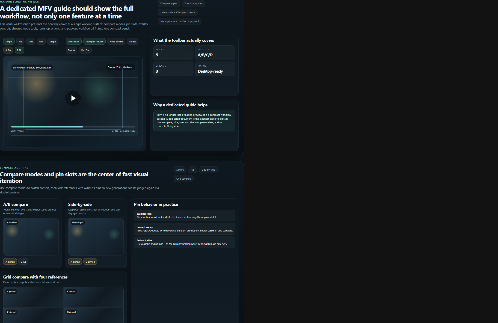
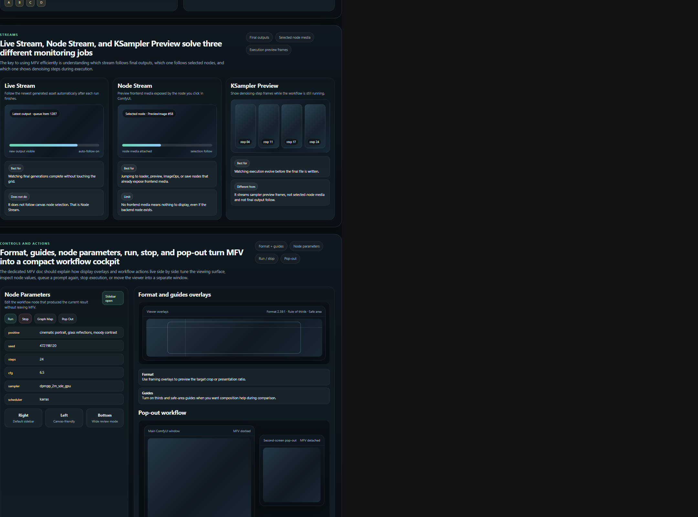
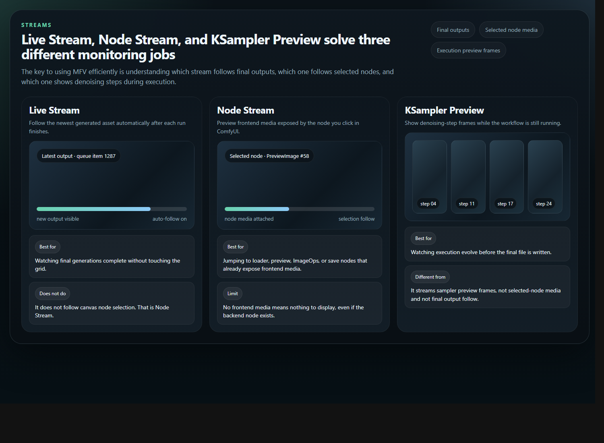
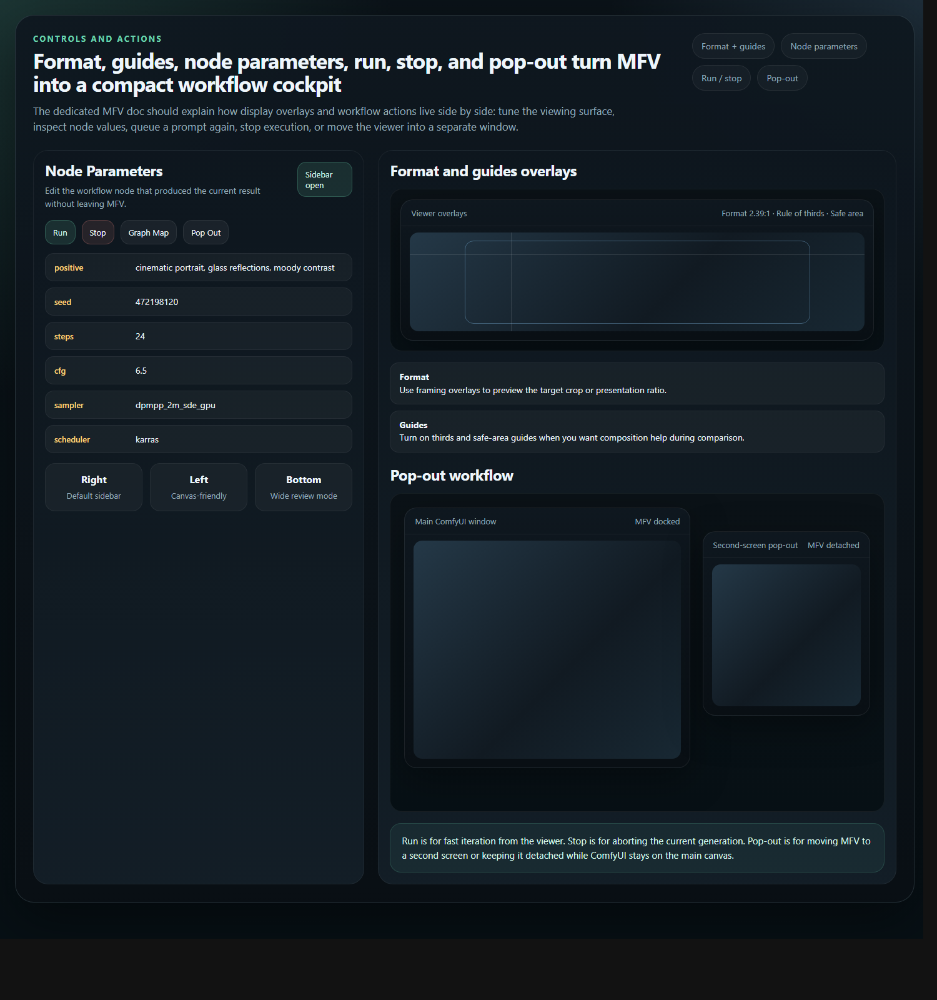

# Majoor Floating Viewer (MFV) Guide

**Last Updated**: May 10, 2026

## Overview

The Majoor Floating Viewer is the fast workflow cockpit inside Majoor Assets Manager.

It is built for one practical goal: keep you close to the current result while giving you the controls you need to compare, follow execution, inspect node outputs, adjust workflow parameters, and relaunch or stop a run without bouncing back and forth between panels.

This guide focuses only on MFV.

## What MFV Covers

MFV is not just a floating preview anymore. It brings together:

- compare modes
- A/B/C/D pin slots
- format and guide overlays
- Live Stream
- Node Stream
- KSampler Preview
- Node Parameters
- Run and Stop actions
- pop-out / detached window workflow

## Opening MFV

You can open the Majoor Floating Viewer from the Assets Manager panel or from the viewer-related UI that already targets MFV in your current setup.

Typical workflow:

1. Select an asset in the grid.
2. Open the Floating Viewer.
3. Pick the mode or stream you want from the MFV toolbar.

## Compare Modes

MFV supports several ways to compare results depending on how much context you need on screen.

### Simple mode

Use this when you want the cleanest single-asset view.

- one asset visible at a time
- best for inspection and overlay controls
- good default when you are reviewing video or a single final image

### A/B compare

Use A/B compare when you want to flip between two candidates quickly.

- ideal for subtle sampler, CFG, or prompt changes
- good for before/after review
- especially useful when one slot is pinned and the other stays live

### Side-by-side compare

Use side-by-side when both assets must remain visible at the same time.

- stronger spatial comparison than A/B switching
- useful for composition and crop review
- good when synchronized zoom/pan matters

### Grid compare

Use grid compare when you want to review several references together.

- suited to broader sweeps
- pairs naturally with A/B/C/D pins
- good for sampler or prompt variation sets

## Pin Mode (A/B/C/D)

The pin system lets you lock up to four references so they stay stable while other slots keep changing.

### What pins are for

- keep your best result as a baseline
- compare new generations against a fixed reference
- hold four selected results in grid compare

### Practical pin patterns

- **A pinned, B live**: best pattern for iterative prompt or sampler work
- **A/B pinned**: useful for deliberate side-by-side review
- **A/B/C/D pinned**: useful for a final selection round in grid compare

Pinned slots are meant to remain stable while unpinned content can keep following the current workflow output.

## Format And Guides

MFV can also act as a framing and presentation surface.

### Format overlays

Use format controls when you want to preview how the media reads inside a target ratio or crop.

- useful for cinematic framing checks
- useful when comparing several outputs against the same intended presentation shape

### Guides

Use guides when you want composition references directly in the viewer.

- rule-of-thirds style guidance
- safe-area style guidance
- fast visual help during compare sessions

These controls matter most when MFV is used as a review surface, not just as a passive preview.

## Live Stream

Live Stream is for final outputs.

- follows newly completed outputs after execution
- best for monitoring what the workflow actually saves
- keeps MFV aligned with the most recent finished result

Use Live Stream when you care about the last completed output file, not the currently selected node.

## Node Stream

Node Stream is for selected-node media.

- follows the node you click in ComfyUI when that node exposes frontend media
- useful for preview nodes, save nodes, loader nodes, and compatible live-preview surfaces
- good for debugging a specific point in the workflow

Use Node Stream when you want to inspect the media attached to the selected node, not the final workflow output.

## KSampler Preview

KSampler Preview is for denoising-step frames during execution.

- shows the progression while the workflow is still running
- useful when you want feedback before the final file exists
- different from Live Stream and different from Node Stream

In short:

- **Live Stream** = final outputs
- **Node Stream** = selected node media
- **KSampler Preview** = execution preview frames

## Node Parameters

Node Parameters let you inspect and edit the workflow node that produced the current result without leaving MFV.

Typical values you will use there:

- prompt text
- seed
- steps
- CFG
- sampler
- scheduler

This makes MFV practical for short iteration loops where you want to tweak one or two values and launch another run immediately.

## Run And Stop

MFV is not only a viewer surface. It also exposes execution actions.

### Run

Use Run when you want to queue the current workflow again directly from MFV.

Good use cases:

- prompt iteration
- seed changes
- sampler or scheduler changes
- quick compare loops with pinned references

### Stop

Use Stop when you want to abort the current generation without leaving the viewer surface.

Good use cases:

- a bad direction is obvious early
- KSampler Preview already tells you the run is not worth finishing
- you want to reclaim time before launching the next variation

## Pop-Out

Pop-out detaches MFV from the main ComfyUI window so it can live as a separate viewer window.

This is useful when:

- you want MFV on a second screen
- you want the canvas and the viewer visible side by side
- you want to keep MFV open as a dedicated monitoring surface while working on the graph elsewhere

## Graph Map As A Natural Companion

Graph Map is the workflow-context side of MFV.

Use MFV when you want to compare outputs, follow streams, inspect node parameters, or relaunch quickly. Open Graph Map when you want to understand where the current result came from in the saved workflow.

Graph Map complements MFV by adding:

- readable node and subgraph names instead of raw opaque identifiers
- a selected-node detail panel with copy-ready parameters and actions
- a workflow overview that stays close to the current asset preview

Typical pairing:

1. Review the latest result in MFV.
2. Open Graph Map to locate the relevant node or subgraph.
3. Inspect the selected node details.
4. Return to Node Parameters or Run inside MFV for the next iteration.

For the full Graph Map walkthrough, including the selected-node detail panel, see [GRAPH_MAP.md](GRAPH_MAP.md).

## Recommended Workflows

### Fast prompt iteration

1. Pin your baseline in slot A.
2. Edit prompt or seed in Node Parameters.
3. Click Run.
4. Let the unpinned slot follow Live Stream.

### Execution monitoring

1. Turn on KSampler Preview.
2. Watch denoising steps during the run.
3. Keep Live Stream ready for the final output.

### Node-focused debugging

1. Turn on Node Stream.
2. Click the relevant node in ComfyUI.
3. Inspect available frontend media from that node.

### Two-screen review

1. Pop out MFV.
2. Keep ComfyUI on the main screen.
3. Use the detached viewer as a dedicated compare and monitoring surface.

## Related Docs

- [GRAPH_MAP.md](GRAPH_MAP.md)
- [VIEWER_FEATURE_TUTORIAL.md](VIEWER_FEATURE_TUTORIAL.md)
- [FLOATING_VIEWER_WORKFLOW_SIDEBAR.md](FLOATING_VIEWER_WORKFLOW_SIDEBAR.md)
- [HOTKEYS_SHORTCUTS.md](HOTKEYS_SHORTCUTS.md)
- [SETTINGS_CONFIGURATION.md](SETTINGS_CONFIGURATION.md)
